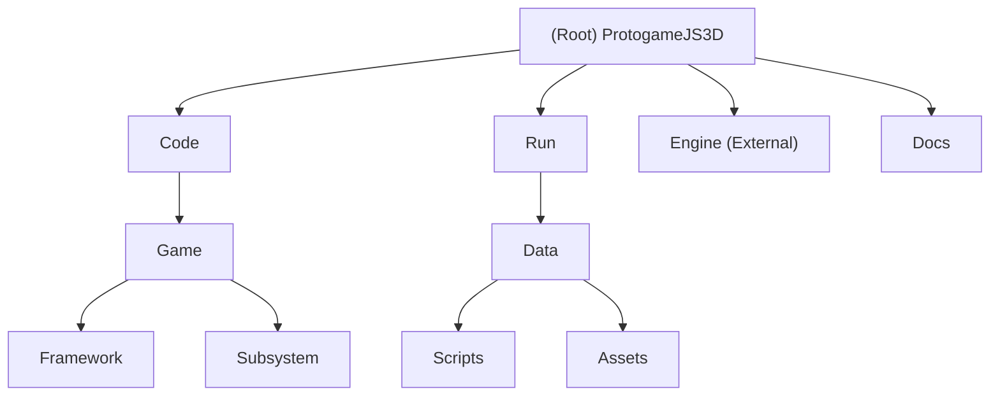

# ProtogameJS3D - Dual-Language Game Engine

## Changelog
- **2025-09-20**: Initial AI context documentation created with adaptive scanning strategy

## Project Vision

ProtogameJS3D (originally FirstV8) is a cutting-edge research project demonstrating **dual-language game engine architecture** through seamless integration of the **Google V8 JavaScript Engine** with a **C++ game engine foundation (DaemonEngine)**. This project bridges high-performance C++ engine systems with flexible JavaScript game logic, enabling rapid prototyping while maintaining production-level performance.

## Architecture Overview

### Dual-Language Integration Model
```
Windows Application Entry
├── C++ Engine Foundation (DaemonEngine)
│   ├── Core Subsystems (Performance Critical)
│   ├── DirectX Rendering Pipeline
│   ├── FMOD Audio System
│   └── Resource Management
├── V8 JavaScript Runtime
│   ├── Game Logic Layer
│   ├── Hot-Reload System
│   └── Chrome DevTools Integration
└── Bidirectional Script Interface
    ├── C++ → JavaScript Bindings
    └── JavaScript → C++ Callbacks
```

### Runtime Execution Flow
```
C++ Main Loop (App.cpp):
├── BeginFrame()
├── Update() ──→ V8::Execute(JSEngine.update()) ──→ JSGame Systems
├── Render() ──→ V8::Execute(JSEngine.render()) ──→ JSGame Rendering
└── EndFrame()
```

## Module Structure Diagram



## Module Index

| Module | Path | Type | Description |
|--------|------|------|-------------|
| **Game Application** | `Code/Game` | C++ Application | Main executable with dual-language architecture, entity systems, and V8 integration |
| **JavaScript Logic** | `Run/Data/Scripts` | JavaScript Module | Game logic, system registration framework, input handling, and hot-reload support |
| **Game Assets** | `Run/Data` | Assets Module | 3D models, HLSL shaders, textures, audio files, and configuration |
| **Engine Foundation** | `../Engine` | C++ Library (External) | DaemonEngine core systems, V8Subsystem, rendering, and platform abstraction |
| **Documentation** | `Docs` | Documentation | Project documentation and research papers |

## Key Technologies

### Core Framework
- **Google V8 JavaScript Engine** v13.0.245.25 - Latest JavaScript runtime
- **DaemonEngine** - Custom C++ game engine foundation
- **Microsoft Visual Studio 2022** - C++20 development environment
- **DirectX Graphics API** - Windows graphics pipeline
- **FMOD Audio Engine** - Professional audio system

### Development Features
- **Hot-Reload System** - JavaScript changes without C++ recompilation
- **Chrome DevTools Integration** - Full debugging support for JavaScript
- **Dual-Language Debugging** - Visual Studio for C++, Chrome DevTools for JavaScript
- **Entity-Component System** - Flexible game object architecture
- **Professional Build Pipeline** - MSBuild with automated V8 deployment

## Running and Development

### Prerequisites
- Visual Studio 2022 with C++ development workload
- Windows 10/11 (x64)
- NuGet Package Manager

### Quick Start
1. **Open Solution**: `ProtogameJS3D.sln` in Visual Studio 2022
2. **Build Configuration**: Select `Debug|x64` or `Release|x64`
3. **Build Solution**: Build → Build Solution (Ctrl+Shift+B)
4. **Run Application**: 
   ```bash
   cd Run
   ProtogameJS3D_Debug_x64.exe  # or ProtogameJS3D_Release_x64.exe
   ```

### Development Workflow
1. **C++ Engine Development**: Modify files in `Code/Game/` and reference `Engine/`
2. **JavaScript Game Logic**: Edit files in `Run/Data/Scripts/` (hot-reload enabled)
3. **Asset Management**: Add resources to `Run/Data/` subdirectories
4. **Configuration**: Modify `Run/Data/GameConfig.xml` for runtime settings

## Testing Strategy

### Current Testing Approach
- **Manual Integration Testing** - Visual testing of dual-language integration
- **JavaScript System Testing** - Runtime system registration and hot-reload verification
- **Performance Profiling** - C++/JavaScript interop performance analysis

### Test Files
- `Run/Data/Scripts/test_scripts.js` - JavaScript functionality testing
- Interactive testing through F1 key toggle functionality
- Chrome DevTools integration for runtime debugging

## Coding Standards

### C++ Standards (Engine/Game)
- **C++20 Standards** - Modern C++ features with full conformance
- **SOLID Principles** - Clean architecture patterns
- **RAII Patterns** - Resource management with automatic cleanup
- **Hungarian Notation** - Consistent naming conventions
- **Professional Documentation** - Academic-grade code documentation

### JavaScript Standards (Game Logic)
- **ES6+ Standards** - Modern JavaScript features
- **Modular Architecture** - Class-based system organization
- **Hot-Reload Compatibility** - File-based reload support
- **Chrome DevTools Integration** - Debugging-friendly code structure
- **System Registration Pattern** - Consistent API for runtime modifications

## AI Usage Guidelines

### Dual-Language Development Considerations
1. **Performance Boundaries** - Keep performance-critical code in C++
2. **Hot-Reload Design** - Structure JavaScript for safe runtime reloading
3. **Type Safety** - Careful handling of C++/JavaScript type conversions
4. **Error Isolation** - JavaScript errors should not crash C++ engine
5. **Memory Management** - Respect RAII patterns and V8 garbage collection

### AI Agent Integration Points
- **JavaScript System Registration** - Runtime system addition/modification
- **Input System Separation** - Isolated file for input handling logic
- **Asset Pipeline Configuration** - Dynamic asset loading and management
- **Chrome DevTools Integration** - Professional debugging environment

### Recommended AI Modifications
- Extend JavaScript systems in `Run/Data/Scripts/`
- Add new subsystems through system registration API
- Modify input handling in `InputSystem.js`
- Create new game logic without touching C++ engine code

## Related Documentation
- [Game Module Details](./Code/Game/CLAUDE.md) - C++ application architecture
- [JavaScript Logic Details](./Run/Data/Scripts/CLAUDE.md) - JavaScript framework and systems
- [Assets and Configuration](./Run/Data/CLAUDE.md) - Game assets and runtime configuration
- [Project README](./Docs/README.md) - Complete project documentation

---

**Project Status**: Active Research Project | **Build Status**: Passing (Debug/Release) | **Documentation**: Academic Grade

*Built with passion for advancing game development research and education*